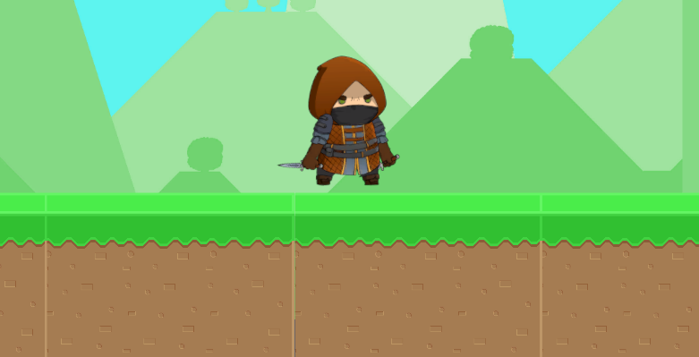
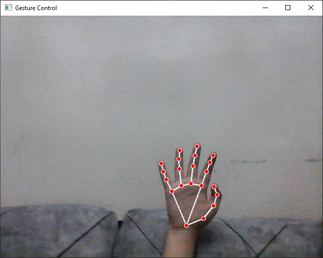

# Hand-Gesture Controlled 2D Platformer Game

This project is the final training project for a Computer Vision course. The aim of the project is to control a character in a 2D platformer game using real-time hand gestures detected through a laptop camera. We utilize the Mediapipe library for hand gesture recognition and integrate it with a Unity game via socket communication.

## Project Overview

The project consists of two main components:

1. **Hand Gesture Detection (Python)**
   - A Python script uses Mediapipe to capture hand movements via a webcam and translates specific hand gestures into control commands for the game.
   - The detected hand gestures are mapped to basic movement commands: `up`, `down`, `left`, `right`, and `stop`.

2. **2D Platformer Game (Unity)**
   - A simple 2D platformer game built in Unity using open-source assets from the Unity Asset Store.
   - The character in the game moves based on the commands sent from the Python script after processing the hand gestures.

### Key Features:
- **Real-time Hand Gesture Detection:** Uses Mediapipe to detect hand movements, with gestures corresponding to different character controls.
- **Socket Communication:** The Python script sends the detected gesture as commands to the Unity game via a socket.
- **2D Platformer Game:** The Unity game features a simple 2D environment where a player character navigates based on hand gestures.
  
## System Architecture

1. **Hand Gesture Detection (Python):**
   - Using the laptop's camera, the Mediapipe library detects hand landmarks and identifies specific gestures.
   - Based on predefined gestures, the Python script translates the hand movements into commands (`up`, `down`, `right`, `left`, `stop`).
   - These commands are sent via a socket to Unity in real-time.

2. **Unity Game (C#):**
   - The Unity game listens for commands over a socket connection.
   - Upon receiving the movement command (e.g., `up`, `right`, etc.), the character in the game moves accordingly.

## Setup Instructions

### Requirements

#### Python (Hand Gesture Detection)
- Python 3.x
- Mediapipe (`pip install mediapipe`)
- OpenCV (`pip install opencv-python`)
- Socket library (already included in Python standard library)

#### Unity (2D Platformer)
- Unity 2021 or later
- Unity assets (open-source assets used from Unity Asset Store)

### Installation

1. **Clone the repository:**

```
git clone https://github.com/Izzat-Kawadri/Hand-Gesture-Controlled-2D-Game.git
```

2. **Python Environment Setup:**
   - Install the necessary Python libraries:
```
    pip install mediapipe opencv-python
```

3. **Unity Project:**
   - Open the Unity project located in the /UnityGame folder using the Unity Editor.

4. **Socket Communication:**
   - Ensure the Python script (`hand_gesture_control.py`) and the Unity game are running on the same machine or network so they can communicate via socket.

### Running the Project

1. **Start the Unity Game:**
    - Open the Unity project and press the Play button in the Unity Editor.

2.  **Start the Python Gesture Detection Script:**
    - Navigate to the python folder in the repository.
    - Run the Python script for hand gesture detection:
```
    python hand_gesture_control.py
```
   


3. **Control the Game:**
    - Use hand gestures in front of your camera to move the character in the game:
       - Raise hand up for "up" command.
       - Lower hand down for "down" command.
       - Move hand right for "right" command.
       - Move hand left for "left" command.
       - Hold hand still for "stop" command.

### Customization

  - You can modify the hand gesture-to-command mappings in the Python script (hand_gesture_control.py).
  - The Unity game can be expanded with more levels, mechanics, or assets from the Unity Asset Store.

### Project Structure
```
/hand-gesture-controlled-2d-platformer
│
├── UnityGame/            # Unity project folder
│   ├── Assets/           # Game assets and scripts
│   └── Scenes/           # Unity scenes and levels
│
├── python/               # Python hand gesture detection code
│   ├── hand_gesture_control.py   # Mediapipe gesture detection script
│
└── README.md             # Project documentation
```
## Screenshots

### Screenshot of Unity Game :

.

### Screenshot of Running the Python Script :

.

## Demonstration

To see the project in action, check out this demo video:

[Watch the video](./Screenshots/Demonstration.mp4).

Click on the Link above to watch the demonstration video.

## Assets Used from Unity Asset Store
Here are the assets used from the Unity Asset Store to create the 2D platformer game:
- [Free Platform Game Assets](https://assetstore.unity.com/packages/2d/environments/free-platform-game-assets-85838)  A collection of platform game assets including Backgrounds, character sprites and tilesets.
- [Mighty Heroes 2d](https://assetstore.unity.com/packages/2d/characters/mighty-heroes-rogue-2d-fantasy-characters-pack-85770) A collection of 2D characters.
## License
 
This project uses open-source assets from the Unity Asset Store and is licensed under the MIT License. See the LICENSE file for more details.

Feel free to contribute to this project by submitting pull requests or reporting any issues you encounter.

